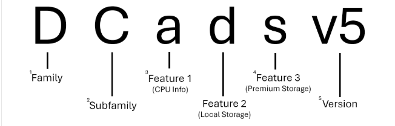
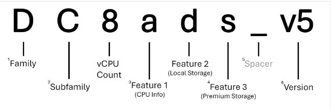

# Sizes for Virtual Machines in Azure

## Name Structure

1. **Series**
    

2. **Size**
    

---

## VM Size Families

### General Purpose
> Balanced CPU-to-memory ratio. Ideal for testing, development, small databases, and low-to-medium traffic web servers.

| Family | Description | Key Advantages |
|--------|-------------|----------------|
| **A-series** | Entry-level, economical | Cost efficiency, dev/test environments, small databases |
| **B-series** | **Burstable** — uses a CPU credit model instead of fixed CPU performance | Flexible for workloads with variable CPU demands |
| **D-series** | Faster processors, more memory per core than A-series | Enterprise apps, web servers, batch processing, game servers |
| **DC-series** | **Security-focused** with hardware-based Trusted Execution Environments (TEEs) | Confidential computing — PII, financial, health data; HIPAA/GDPR compliance |

---

### Compute Optimised
> High CPU-to-memory ratio. Good for web servers, batch processing, analytics, and gaming.

| Family | Description | Key Advantages |
|--------|-------------|----------------|
| **F-series** | High CPU performance, lower memory | Batch jobs, web servers, analytics, **gaming servers** |

---

### Memory Optimised
> High memory-to-CPU ratio. Great for databases, caches, and in-memory analytics.

| Family | Description | Key Advantages |
|--------|-------------|----------------|
| **E-series** | High memory-to-core ratio | Large databases (SQL/NoSQL), big data, scientific simulations |
| **Eb-series** | E-series + **high remote storage performance** | Memory-intensive workloads needing fast remote storage |
| **EC-series** | **Confidential computing** with TEEs | Secure memory-intensive workloads |
| **M-series** | Extremely large memory configurations | Ultra-memory-intensive workloads |

---

### Storage Optimised
> High disk throughput and I/O. Ideal for Big Data, SQL/NoSQL, data warehousing (Cassandra, MongoDB, Redis).

| Family | Description |
|--------|-------------|
| **L-series** | High disk throughput and I/O for databases, big data, and data warehousing |

---

### GPU Accelerated
> Specialised VMs with single, multiple, or fractional GPUs for compute-intensive and graphics workloads.

| Family | Description |
|--------|-------------|
| **NC-series** | **Compute-intensive** — AI/ML training, HPC, graphics |
| **ND-series** | **Deep learning** and AI research with powerful GPU acceleration |
| **NG-series** | **Cloud gaming** and remote desktop using AMD Radeon™ PRO GPUs |
| **NV-series** | Graphics rendering, simulation, and **virtual desktops** |
